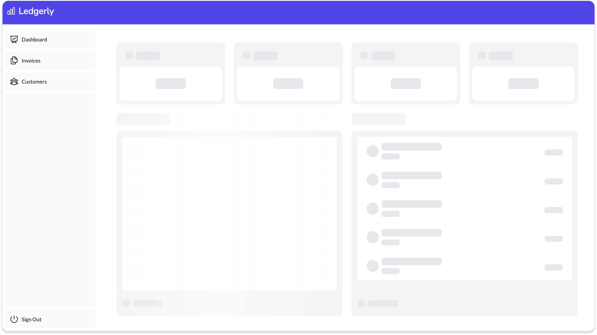

# Dashboard Billing Application

## Overview

This is a dashboard billing application built with React using Next.js and TypeScript. It is deployed on Vercel and uses PostgreSQL for database management. The application provides a comprehensive interface for managing and viewing billing-related information, including revenue, customers, invoices, and more.



## Features

- **Dashboard View**: Displays key metrics including revenue, customers, and the latest invoices.
- **Invoices Page**: View all invoices, with options to filter by paid or pending status. Users can also create new invoices.
- **Customers Page**: A comprehensive list of all customers.

## Technologies

- **Frontend**: React, Next.js, TypeScript
- **Backend**: PostgreSQL
- **Deployment**: Vercel

## Getting Started

To get started with this project locally, follow these steps:

### Prerequisites

Ensure you have the following installed:

- [Node.js](https://nodejs.org/) (v16 or later)
- [pnpm](https://pnpm.io/) (preferred package manager)

### Installation

1. **Clone the Repository**

   ```bash
   git clone https://github.com/christinaluna/nexjs-dashboard.git
   cd nextjs-dashboard

2. **Install Dependencies**

    ```bash
    pnpm install

3. **Setup Environment Variables**

    ```bash
    POSTGRES_URL=""
    POSTGRES_PRISMA_URL=""
    POSTGRES_URL_NO_SSL=""
    POSTGRES_URL_NON_POOLING=""
    POSTGRES_USER=""
    POSTGRES_HOST=""
    POSTGRES_PASSWORD=""
    POSTGRES_DATABASE=""
    AUTH_SECRET=
    AUTH_URL=http://localhost:3000/api/auth

4. Run the Development Server

    Start the development server with:

    ```bash
    pnpm run dev

The application should now be running at http://localhost:3000.